<p align="center">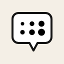</p>

# HQ Tools: comics tools for Krita

[Português](README.md) · **English**

Krita plugin with screentones and hatching, vector speech balloons and sound
effects, an asset library, a page manager, brush shortcuts, a 3D viewer, a
perspective line library and a hub to open and close the modules. Built for
Krita 5.3.4 (AppImage, PyQt5) with preparation for Krita 6 (PyQt6). The
project documentation is written in Portuguese; this file is the English
overview.

## Demo

**Plugin update:** the video shows HQ Tools in action, from the hub to the comics tools (screentones, balloons, pages, brushes, 3D, perspective, moodboard and production).

[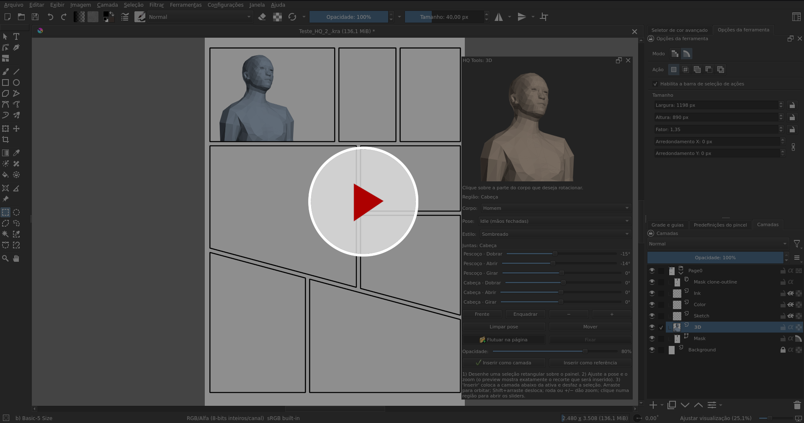](https://youtu.be/qzLnXSGgufc)

▶ **Video:** [Krita HQ Tools - Update](https://youtu.be/qzLnXSGgufc) (the plugin update in action).

## Screenshots

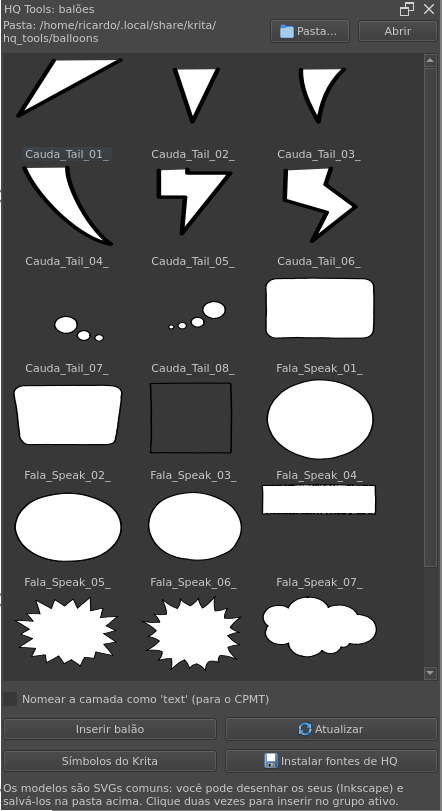

| Pages | Library | Brushes |
|---|---|---|
| 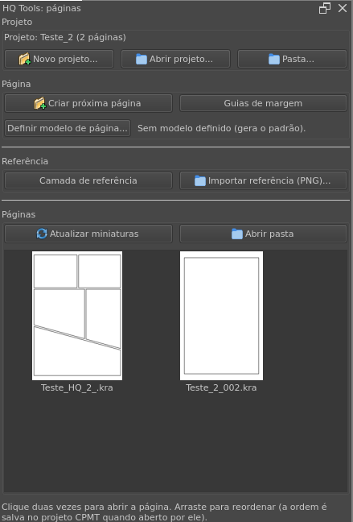 | 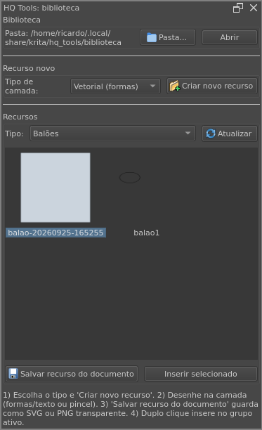 | 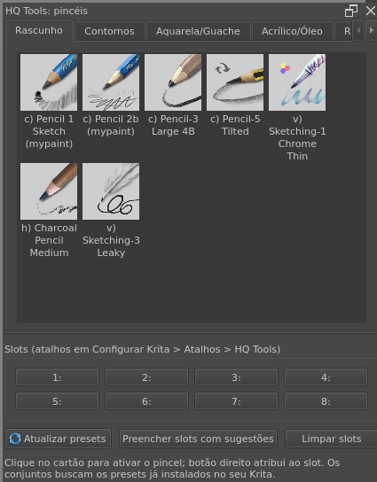 |

| Screentones and action lines | Onomatopoeia | Palettes |
|---|---|---|
| 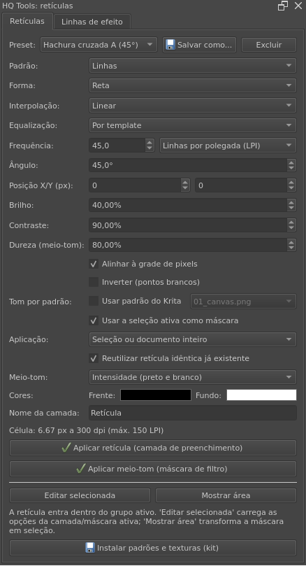 | 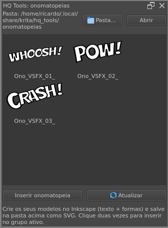 | 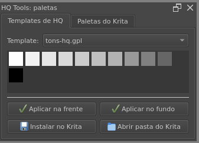 |

| 3D viewer | Hub |
|---|---|
| 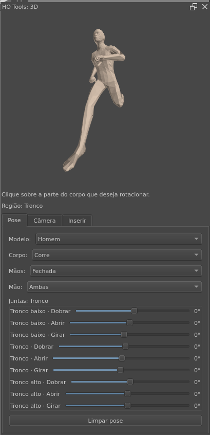 | 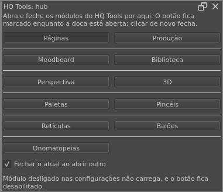 |

| Perspective library | Hub and 3D in Krita |
|---|---|
| 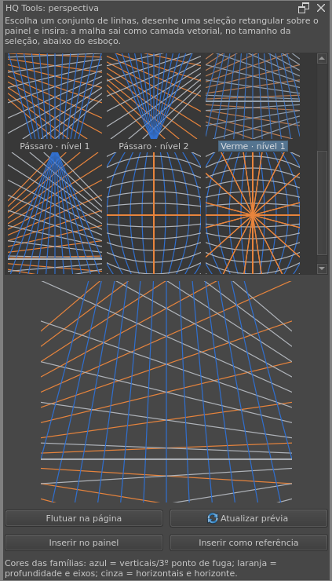 | 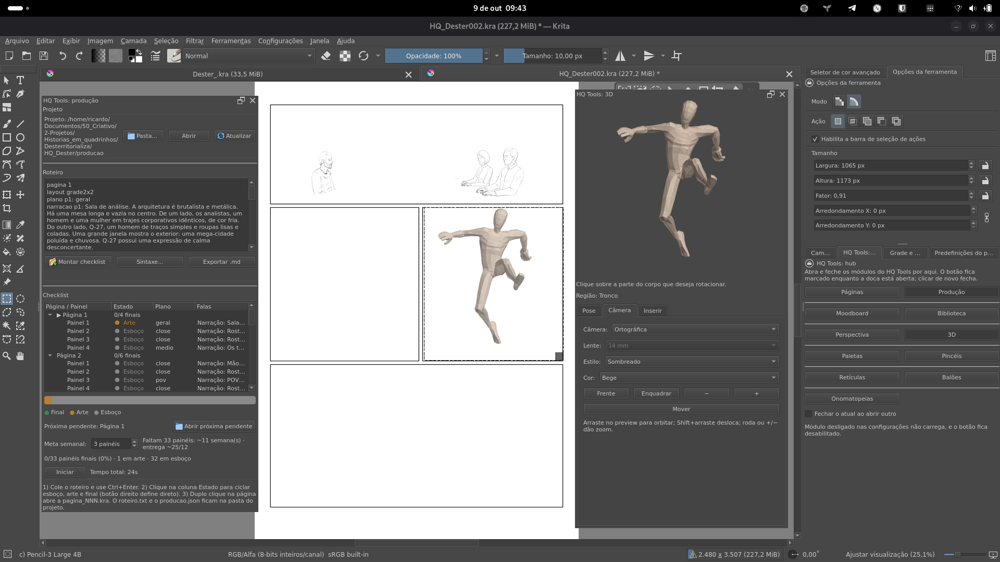 |

| Moodboard |
|---|
| 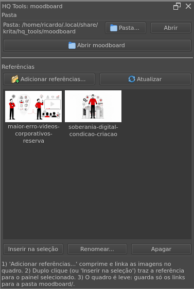 |

| Production |
|---|
| 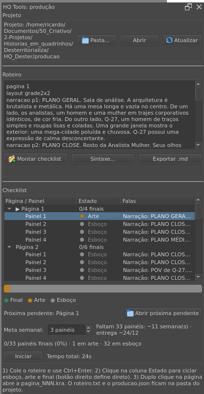 |

## Modules

| Module | What it does |
|---|---|
| Screentones and hatching | Screentone presets with real LPI (cell computed from the document DPI), applied as a non-destructive fill layer inside the panel group, halftone as a Halftone filter mask over painted tone, tone with Krita patterns, CMYK per-channel color halftone, editing the applied screentone, empty mask to reveal by painting, show area, reuse of identical tones, pattern position and effect/speed lines (with an active selection, the lines use its area). |
| Balloons | Catalog of SVG vector balloons (the author's hand-drawn kit and CC0 samples on first run, own folder), insert into the active group (with a selection, shrunk and centered in it, clearing the selection; without one, at the center of the view), `text` layer option for CPMT, a button that opens the native "Symbol Libraries" docker and installs the included comic fonts. |
| Onomatopoeia | Catalog of SVG sound effects (3 samples, own folder), inserted as vectors (with a selection, shrunk and centered in it, clearing the selection; without one, at the center of the view); draw your own in Inkscape. |
| Project library | Create your own balloons, panels and onomatopoeia inside Krita: "Create new resource" opens a 15 x 15 cm document at 300 dpi; "Save resource from document" exports the active layer as SVG (vector) or transparent PNG (painting, trimmed by the layer) to the library; double-click inserts it into the active group (in the active selection or at the center of the view, clearing the selection); Rename, Duplicate and Delete organize the folder. |
| Palettes | Comic and artistic templates (tones, ink, skin, sky, vegetation, flat colors, Zorn, portrait, landscape, dawn, night, earth, pastel, watercolor, gouache, acrylic, retro, BD, superhero, manga, sepia), applied to the foreground/background color, installed into Krita and previewed from the installed palettes. |
| Pages | Manager with internal `.kra` thumbnails: "New project..." uses the saved page folder (writes comicConfig.json and creates the project library and the producao/ folder), "Open project..." reads a CPMT `comicConfig.json` and "Folder..." opens any folder; "Create next page" opens a dialog (A4/A5/A3/strip format, DPI and strip panels), generates the page with automatic margin guides and refreshes the grid; "Set page template" uses the current page or a Krita comic template (BD, US, manga...) as the model; "Reference layer" marks the selected layer and "Import reference (PNG)" inserts a locked reference into the active group. New pages come with the "Arte" group and the "Panel mask" (paint only inside; hide the mask to paint outside). |
| Brushes | Suggested sets (Sketching, Inking, Watercolor/Gouache, Acrylic/Oil, Screentones) with thumbnail + name cards built from the brush presets installed in Krita; 8 slots with configurable shortcuts (right-click a slot to clear one or all, and the "Clear slots" button empties them); "Packs" tab with community brushes with verified licenses (one-click install and license display) and the brush bundle installer. |
| 3D viewer | Posable low-poly mannequin (author's mesh with the Auto-Rig Pro rig) as reference, with model choice (Man/Woman) and a pose library split into body (Idle, Fly, Walk, Run, Jump, Boxing, Sitting and Pose A) and hands (Closed, Open, Holding and Thumbs up, authored for the right hand, each hand with its own box and the left one receiving the mirrored version): drag to orbit; the mouse wheel or the −/+ buttons zoom; Shift+drag, the middle mouse button or the Move button pan the framing, and "Fit" recenters; click a region (head, torso, arm, leg) to open Bend/Open/Twist sliders for that joint. The controls live in tabs (Pose, Camera and Insert), with the preview always visible; the camera can be orthographic (default) or perspective with 14/28/35 mm lenses (the lens changes only the convergence, without spilling out of the frame), and the mannequin color is selectable (beige, blue, ice or graphite). Draw a selection over the panel and the preview adopts its aspect ratio (WYSIWYG, camera zoom and pan included); "Float on page" only opens with a selection and appears over it (drag/resize, opacity and lock mode), and the insertion lands at the exact selection size, below the sketch, clearing the selection. |
| Perspective | Library of 9 perspective grids (one-point, two-point, three-point, bird's and worm's eye in two levels, 4- and 5-point curvilinear) with thumbnails and a preview that adopts the selection aspect ratio: "Float on page" shows the grid over the selection (drag and wheel); the insertion lands as an editable vector layer (each line with two nodes) at the exact selection size, below the sketch, as a layer or a locked reference, inside a macro (one Ctrl+Z undoes it) and clearing the selection. |
| Moodboard | Project reference board, light because it stores only links: "Add references..." resizes (max side 1600 px) and saves the images as JPG in the project's `moodboard/` folder (the originals stay untouched) and inserts them into `moodboard.kra` as file layers on a grid that grows; double-click (or "Insert into selection") brings the reference to the selected panel, locked and fitted to the selection, for tracing over; Rename and Delete manage the folder (with the board open, the layer is updated along). |
| Production | Script checklist: paste the text (the same syntax as the pages, with the optional character on the line, e.g. `fala p1 joao: ...`) and use Ctrl+Enter; the script auto-saves (with a "saved HH:MM" hint) and each page becomes a node with the layout panels; each panel has three states with a colored dot in the tree (sketch, art and final; click the State column to cycle, right-click sets it directly), with the lines and characters in view; the bar on top shows the progress in three colors and the "Open next pending" button jumps to the first unfinished page; production time is counted with the Start/Pause button (total and per page, in `tempos.json`); the weekly panel goal shows what is left and the expected date, double-click opens the `pagina_NNN.kra` and "Export .md" saves the checklist with checkboxes, state emojis and per-page time; `roteiro.txt`, `producao.json` and `tempos.json` live in the project's `producao/` subfolder (created with the project; without a project open, it saves in the plugin default folder and warns to choose the folder), and the "Syntax..." button shows the full format. |
| Hub | Control center to open and close the modules: one button per docker, checked while the dock is open (click again to close), grouped by dividers (Pages/Production, Moodboard/Library, Perspective/3D, Palettes/Brushes, Screentones/Balloons and Sound effects); the "Close the current one when opening another" option toggles between one module at a time and docks living together; a module disabled in the settings gets a disabled button with a warning. |

## Comic kit (fonts and free balloons)

The plugin ships a kit with licenses documented in `CREDITS.en.md`:

- **Fonts** (SIL OFL 1.1): Bangers, Comic Relief (Regular/Bold), Patrick
  Hand, Comic Neue (Regular/Bold), the full Londrina family (Solid, Shadow,
  Outline, Sketch), Nanum Pen Script, Gaegu and Boogaloo, installable with one
  click in the balloons docker;
- **Public-domain balloons** (CC0/PD): copied to the default folder on first
  run;
- **Own patterns and textures** (11 tiles: papers, extra screentones, manga
  hatch, hatching, grain), installable in the screentones docker and used by
  the "tone with pattern" mode;
- **Page templates** generated by the plugin (A4, A3, 1-3 strips, 2x2 and 3x3
  grids) in "Set page template";
- **Community brushes** ("Packs" tab in the brushes docker): Deevad v8.2
  (David Revoy, CC-BY 4.0) and Krita Watercolor Set (Vasco Basqué, CC-0),
  one-click install, each with license and credits.

## Transparency

The code was developed with AI assistance (opencode + DeepSeek) in the
coding. The plugin **has no AI features** and the kit **includes no
AI-generated art**: the assets are the author's own (hand-drawn balloons and
sound effects, icon in Penpot, code-generated patterns) or third-party under
free licenses, listed in `CREDITS.en.md`.

## Installation

Complete end-user guide (ZIP, manual, Flatpak, uninstall and troubleshooting):
**`INSTALL.en.md`**.

Development mode (edit and test straight from the repository):

```bash
bash scripts/install-dev.sh
```

Distribution (ZIP for Tools > Scripts > Import Python Plugin from File):

```bash
bash scripts/build-zip.sh
# result in dist/hq_tools-<version>.zip
```

Then: enable **HQ Tools** in the Python Plugin Manager and restart Krita. If
you installed from the ZIP, copy `hq_tools.action` (inside the ZIP) to
`~/.local/share/krita/actions/` to get the default brush shortcuts in
Configure Krita > Shortcuts (the `install-dev.sh` script does that for you).
The dockers live in Settings > Dockers with the "HQ Tools" prefix; to group
them as tabs of one panel, drag one docker over another (Krita merges them
automatically, and you can ungroup whenever you want).

## Quick start

1. **Screentone**: "HQ Tools: screentones" docker, pick a preset (e.g. medium
   shadow 60 LPI) and "Apply screentone". The plugin uses the document DPI for
   the cell math; check "Use active selection" to limit it to the panel. After
   applying, select the layer and use "Edit selected" to adjust LPI, angle and
   position without recreating anything.
2. **Halftone**: paint the tone on a layer and apply "Halftone (filter mask)";
   the preset becomes dots or lines reactive to the painted tone. In a CMYKA
   document, the "Color per channel" mode uses the printing angles (15/75/0/45).
3. **Balloon**: double-click the model; the balloon enters the active group as
   a vector. Install the comic fonts with one click and, if you want, create
   your own balloons in the "Project library" docker.
4. **Pages**: save the current page to a folder and "New project..." uses that
   folder (creates comicConfig.json and the project library); "Create next
   page" asks for format/DPI (A3, strip, free...) and is born with margin
   guides; "Set page template" lets you use the current page or a Krita comic
   template as the base; references come in through "Reference layer" or
   "Import reference (PNG)".
5. **Brushes**: browse the sets (Sketching, Inking, Watercolor/Gouache,
   Acrylic/Oil, Screentones), click the card to activate; right-click assigns
   to a slot. Shortcuts in Configure Krita > Shortcuts > Scripts > HQ Tools.
6. **Effect lines**: in the screentones docker, "Effect lines" tab: choose
   focus or parallel and insert as vectors.
7. **Project library**: choose "Vector" or "Painting", "Create new resource"
   opens the 15 x 15 cm document at 300 dpi; draw, "Save resource from
   document" and insert with a double-click. Paintings come out as transparent
   PNG trimmed by the active layer. Rename, Duplicate and Delete organize the
   list.
8. **3D viewer**: in the "HQ Tools: 3D" docker, choose the model (Man or
   Woman) and the body and hand poses (default: Idle + Closed; each hand has
   its own box and the left one receives the mirrored version); drag to orbit, use
   Shift+drag (or the Move button) to pan, the wheel or the −/+ buttons to
   zoom and "Fit" to recenter; click a body region to pose. Draw a rectangular
   selection over the panel: the preview shows exactly the crop (use zoom for
   details, like a hand) and "Float on page" appears over the selection.
   "Insert as layer" or "as reference" places it at the selection size, below
   the sketch, and clears the selection.
9. **Production**: paste the script in the "HQ Tools: production" docker and
   use Ctrl+Enter (the text auto-saves, with a "saved HH:MM" hint); click the
   State column to cycle sketch → art → final (the dot shows the color), follow
   the progress bar and use "Open next pending" to jump straight to the missing
   page; the Start/Pause button counts production time (total and per page) and
   "Export .md" writes the checklist with checkboxes, emojis and time.

## Development

```bash
python3 -m unittest discover -s tests -v   # core tests (outside Krita)
```

- Architecture: `docs/ARQUITETURA.md`
- Technical discovery (Krita API, configuration keys): `docs/DESCOBERTA.md`
- Validation inside Krita: `docs/VALIDACAO.md`

The pure core (script parser, screentone presets, comicsConfig, GPL palettes)
does not import `krita` and runs on any Python. The interface modules import
`krita` and only run inside Krita.

## Configuration

Everything in `~/.local/share/krita/hq_tools/`:

- `config.json` (enabled modules, presets, folders, brush slots);
- `screentone_presets.json` (user screentone presets);
- `balloons/` (balloon models, with samples on first run).

The interface follows the system language: a Portuguese locale uses
Portuguese, everything else uses English; the environment variable
`HQ_TOOLS_IDIOMA=pt|en` forces a language. The manual and the install guide
have English versions (`hq_tools_manual.en.html`, `INSTALL.en.md`).

## Community

- **Discussions** (questions, ideas and showcases): https://github.com/ricolandia/krita-hq-tools/discussions
- **Issues** (bugs and requests): https://github.com/ricolandia/krita-hq-tools/issues

## License

MIT. Uses native Krita resources: the Screentone generator and the Halftone
filter (Deif Lou) and the Comics Project Management Tools (Krita team). See
`LICENSE`.

## ☕ Support this project

**🇧🇷 Pix:** `ricardograca@ricolandia.com`  
**💳 PayPal:** [Donate](https://www.paypal.com/cgi-bin/webscr?cmd=_donations&business=ricolandia%40gmail.com&currency_code=BRL)  
**🧡 GitHub Sponsors:** [github.com/sponsors/ricolandia](https://github.com/sponsors/ricolandia)
