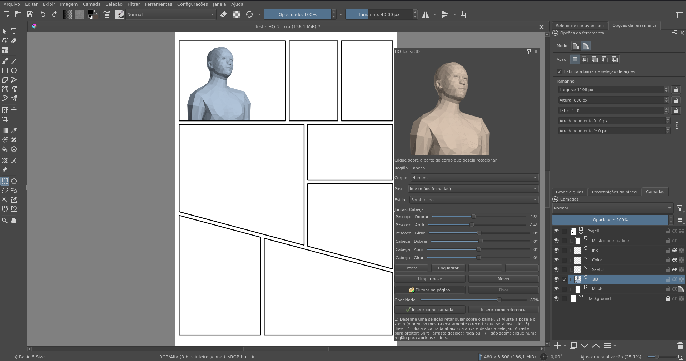
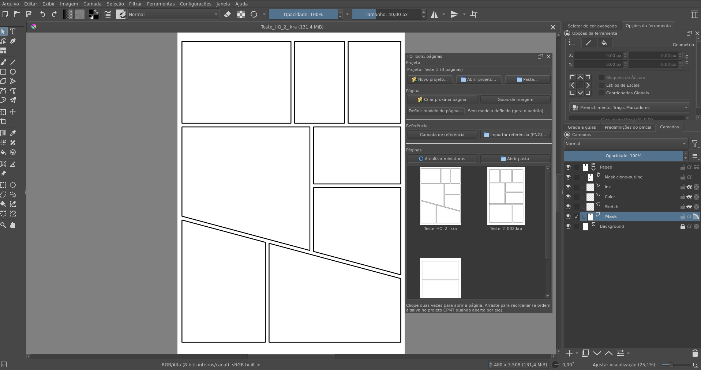

<p align="center"></p>

# HQ Tools: ferramentas de quadrinhos para o Krita

**Português** · [English](README.en.md)

Plugin do Krita com retículas e hachuras, balões vetoriais, paletas,
gerenciador de páginas com miniaturas e atalhos de pincel. Feito para o
Krita 5.3.4 (AppImage, PyQt5) com preparação para o Krita 6 (PyQt6).

Os quatro documentos originais de contexto do projeto estão em
`docs/contexto/`.

## Demo

**Visualizador 3D sobre a página:** escolha o corpo e a pose, desenhe uma seleção retangular sobre o painel de destino (o preview adota a proporção dela e mostra o recorte exato, com zoom de até 12x para detalhes), use "Flutuar na página" para ver sobre o painel e "Inserir como camada" ou "como referência": a camada sai no tamanho da seleção, abaixo do esboço, e a seleção é desfeita.

[](https://youtu.be/0rfDIr2QTDE)

▶ **Vídeo curto:** [Krita tools - update 3Dfloat](https://youtu.be/0rfDIr2QTDE) (o fluxo do 3D float em uso).

[](https://youtu.be/B9KYYyLdHF0)

## Capturas


| Páginas | Biblioteca | Pincéis |
|---|---|---|
|  |  |  |

| Retículas e linhas de ação | Onomatopeias | Paletas |
|---|---|---|
|  |  |  |

| Visualizador 3D |
|---|
|  |

## Módulos

| Módulo | O que faz |
|---|---|
| Retículas e hachuras | Presets de retícula com LPI real (célula calculada pelo DPI do documento), aplicação como camada de preenchimento não destrutiva dentro do grupo do painel, meio-tom como máscara do filtro Halftone sobre tom pintado, tom com padrões do Krita, meio-tom colorido por canal (CMYK), edição da retícula já aplicada, máscara vazia para revelar pintando, mostrar área, reutilização de tons idênticos, posição do padrão e linhas de efeito/velocidade. |
| Balões | Catálogo de balões vetoriais em SVG (kit handdrawn do autor e amostras CC0 na primeira execução, pasta própria), inserção com um clique no grupo ativo, opção de camada `text` para o CPMT, botão que abre o docker nativo "Bibliotecas de símbolos" e instalação das fontes de HQ inclusas. |
| Onomatopeias | Catálogo de efeitos sonoros em SVG (3 amostras, pasta própria), inserção como vetor; crie os seus no Inkscape. |
| Biblioteca do projeto | Cria os seus balões, painéis e onomatopeias dentro do Krita: "Criar novo recurso" abre um documento 15 x 15 cm a 300 dpi; "Salvar recurso do documento" exporta a camada ativa como SVG (vetorial) ou PNG transparente (pintura, recortada pela camada) na biblioteca; duplo clique insere no grupo ativo; Renomear, Duplicar e Apagar organizam a pasta. |
| Paletas | Templates de HQ e artísticas (tons, nanquim, pele, céu, vegetação, chapadas, Zorn, retrato, paisagem, amanhecer, noite, terra, pastel, aquarela, guache, acrílico, retrô, BD, super-herói, mangá, sépia), aplicação na cor de frente/fundo, instalação no Krita e visualização das paletas instaladas. |
| Páginas | Gerenciador com miniaturas internas dos `.kra`: "Novo projeto..." usa a pasta da página salva (grava comicConfig.json e cria a biblioteca do projeto), "Abrir projeto..." lê um `comicConfig.json` do CPMT e "Pasta..." abre qualquer pasta; "Criar próxima página" abre um diálogo (formato A4/A5/A3/tirinha/americano/tankobon/quadrado/livre, DPI e painéis da tirinha), gera a página com guias de margem automáticas e atualiza a grade; "Definir modelo de página" usa a página atual ou um template de HQ do Krita (BD, EUA, mangá...) como modelo; "Camada de referência" marca a camada selecionada e "Importar referência (PNG)" insere uma referência travada no grupo ativo. As páginas novas vêm com o grupo "Arte" e a "Máscara dos painéis" (pinte só dentro; esconda a máscara para pintar fora). |
| Pincéis | Conjuntos sugeridos (Rascunho, Contornos, Aquarela/Guache, Acrílico/Óleo, Retículas) com cartões de miniatura + nome, montados com os presets instalados no Krita; 16 slots com atalhos configuráveis; aba "Packs" com pincéis da comunidade de licença verificada (instala com um clique e mostra a licença) e o instalador de bundle. |
| Visualizador 3D | Manequim low-poly posável (MakeHuman + Auto-Rig Pro) como referência, com escolha de corpo (Homem/Mulher) e biblioteca de poses (padrão: Idle com mãos fechadas): arraste para orbitar; a roda do mouse ou os botões −/+ dão zoom; Shift+arraste, o botão do meio ou o botão Mover deslocam o enquadramento, e "Enquadrar" centraliza; um clique numa região (cabeça, tronco, braço, perna) abre os sliders Dobrar/Abrir/Girar daquela junta. desenhe uma seleção sobre o painel e o preview adota a proporção dela (WYSIWYG, com zoom e deslocamento da câmera); "Flutuar na página" só abre com seleção e aparece sobre ela (arraste/redimensione, opacidade e modo fixar), e a inserção sai no tamanho exato da seleção, abaixo do esboço, desfazendo a seleção. Em teste. |

## Kit de HQ (fontes e balões livres)

O plugin acompanha um kit com licenças documentadas em `CREDITS.md`:

- **Fontes** (SIL OFL 1.1): Bangers, Comic Relief (Regular/Bold), Patrick
  Hand, Comic Neue (Regular/Bold), família Londrina completa (Solid, Shadow,
  Outline, Sketch), Nanum Pen Script, Gaegu e Boogaloo, instaláveis com um
  clique no docker de balões;
- **Balões** de domínio público (CC0/PD): copiados para a pasta padrão na
  primeira execução;
- **Padrões e texturas** próprios (11 tiles: papéis, retículas extras, trama
  de manga, hachuras, granulado), instaláveis no docker de retículas e usados
  pelo modo "tom com padrão";
- **Modelos de página** gerados pelo plugin (A4, A3, tirinhas 1-3, grades 2x2
  e 3x3) no "Definir modelo de página";
- **Pincéis da comunidade** (aba "Packs" no docker de pincéis): Deevad v8.2
  (David Revoy, CC-BY 4.0) e Krita Watercolor Set (Vasco Basqué, CC-0),
  instaláveis com um clique, cada um com licença e créditos.

## Instalação

Guia completo para usuário final (ZIP, manual, Flatpak, desinstalação e
solução de problemas): **`INSTALL.md`**.

Modo desenvolvimento (editar e testar direto do repositório):

```bash
bash scripts/install-dev.sh
```

Distribuição (ZIP para Ferramentas > Scripts > Importar plugin Python):

```bash
bash scripts/build-zip.sh
# resultado em dist/hq_tools-<versão>.zip
```

Depois: ative **HQ Tools** no Gerenciador de plugins Python e reinicie o
Krita. Se instalou pelo ZIP, copie o `hq_tools.action` (dentro do ZIP) para
`~/.local/share/krita/actions/` para ter os atalhos padrão de pincel em
Configurar Krita > Atalhos (o `install-dev.sh` faz isso sozinho). Os dockers
ficam em Configurações > Dockers com o prefixo "HQ Tools"; para agrupá-los
como abas de um mesmo painel, arraste um docker sobre o outro (o Krita junta
automaticamente; você pode desagrupar quando quiser).

## Uso rápido

1. **Retícula**: docker "HQ Tools: retículas", escolha um preset (ex.: Sombra
   média 60 LPI) e "Aplicar retícula". O plugin usa o DPI do documento para a
   conta de célula; marque "Usar a seleção ativa" para limitar ao painel.
   Depois de aplicar, selecione a camada e use "Editar selecionada" para
   ajustar LPI, ângulo e posição sem recriar nada.
2. **Meio-tom**: pinte o tom numa camada e aplique "Meio-tom (máscara de
   filtro)"; o preset vira pontos ou linhas reativos ao tom. Em documento
   CMYKA, o modo "Cores por canal" usa os ângulos de impressão (15/75/0/45).
3. **Balão**: duplo clique no modelo; o balão entra no grupo ativo como vetor.
   Instale as fontes de HQ com um clique e, se quiser, crie os seus balões no
   docker "Biblioteca do projeto".
4. **Páginas**: salve a página atual em uma pasta e "Novo projeto..." usa essa
   pasta (cria comicConfig.json e a biblioteca do projeto); "Criar próxima
   página" pede formato/DPI (A3, tirinha, livre...) e nasce com guias de
   margem; "Definir modelo de página" permite usar a página atual ou um
   template de HQ do Krita como base; referências entram por "Camada de
   referência" ou "Importar referência (PNG)".
5. **Pincéis**: navegue pelos conjuntos (Rascunho, Contornos, Aquarela/Guache,
   Acrílico/Óleo, Retículas), clique no cartão para ativar; botão direito
   atribui ao slot. Atalhos em Configurar Krita > Atalhos > Scripts > HQ Tools.
6. **Linhas de efeito**: no docker de retículas, aba "Linhas de efeito":
   escolha foco ou paralelas e insira como vetor.
7. **Biblioteca do projeto**: escolha "Vetorial" ou "Pintura", "Criar novo
   recurso" abre o documento 15 x 15 cm a 300 dpi; desenhe, "Salvar recurso do
   documento" e insira com duplo clique. A pintura sai como PNG transparente
   recortado pela camada ativa. Renomear, Duplicar e Apagar organizam a lista.
8. **Visualizador 3D**: no docker "HQ Tools: 3D", escolha o corpo (Homem ou
   Mulher) e a pose (a padrão é Idle com mãos fechadas); arraste para orbitar,
   use Shift+arraste (ou o botão Mover) para deslocar, a roda ou os botões −/+
   para o zoom e "Enquadrar" para centralizar; clique numa região do corpo para
   posar. Desenhe uma seleção retangular sobre o painel: o preview mostra
   exatamente o recorte (use o zoom para detalhes, como uma mão) e "Flutuar na
   página" aparece sobre a seleção. "Inserir como camada" ou "como referência"
   coloca no tamanho da seleção, abaixo do esboço, e desfaz a seleção.

## Desenvolvimento

```bash
python3 -m unittest discover -s tests -v   # testes do núcleo (fora do Krita)
```

- Arquitetura: `docs/ARQUITETURA.md`
- Descoberta técnica (API do Krita, chaves de configuração): `docs/DESCOBERTA.md`
- Validação dentro do Krita: `docs/VALIDACAO.md`

O núcleo puro (parser de roteiro, presets de retícula, comicsConfig, paletas
GPL) não importa `krita` e roda em qualquer Python. Os módulos de interface
importam `krita` e só executam dentro do Krita.

## Configuração

Tudo em `~/.local/share/krita/hq_tools/`:

- `config.json` (módulos habilitados, presets, pastas, slots de pincel);
- `screentone_presets.json` (presets de retícula do usuário);
- `balloons/` (modelos de balão, com amostras na primeira execução).

## Licença

MIT. Usa recursos nativos do Krita: gerador Screentone e filtro Halftone
(Deif Lou) e o Comics Project Management Tools (time do Krita). Ver `LICENSE`.